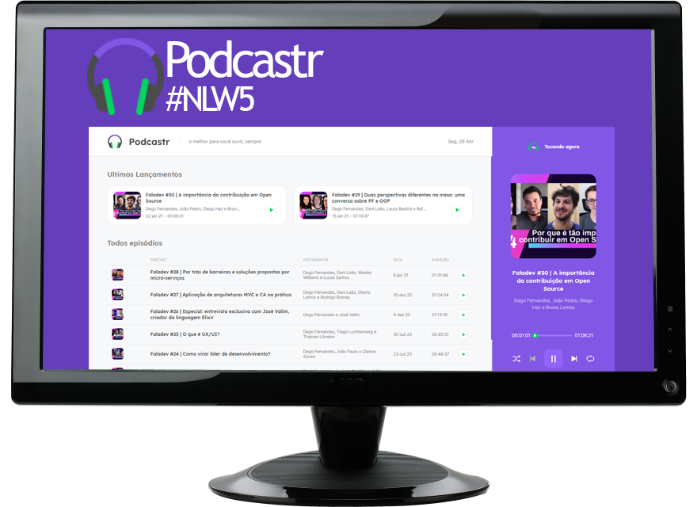

<h1 align="center">
     
</h1>

<h3 align="center">
  Plataforma desenvolvida durante a semana NLW#5 da ROCKETSEAT
</h3>

<br><br>
<h3 align="center">Versão 1.0</h3>
<br><br>

### INDICE

- [SOBRE](#-SOBRE)
- [TECNOLOGIAS](#-TECNOLOGIAS)
- [BAIXAR E INSTALAR](#-COMO-BAIXAR-E-RODAR-O-PROJETO)

---

<h1>

</h1>

---

## 📖 SOBRE


O Podcast é uma plataforma construída para transmissão de podcast de desenvolvedores. 
Construida consumindo uma fake API, esse projeto foi construido durante o 5º NLW, um evento promovido pela [Rocketseat](https://www.youtube.com/channel/UCSfwM5u0Kce6Cce8_S72olg).



---

## 💻 TECNOLOGIAS 

Neste projeto foram usadas as tecnologias abaixos:

- [ReactJS](https://pt-br.reactjs.org)
- [Next.js](https://nextjs.org/)
- [Typescript](https://typescriptlang.org/)
- [SASS](https://sass-lang.com/)
- [Axios](https://github.com/axios/axios)
- [Date-fns](https://date-fns.org/)

---

##  📚 COMO BAIXAR E RODAR O PROJETO :

Para baixar e rodar o projeto tenhao [Git](https://git-scm.com/) e o [Yarn](https://yarnpkg.com/) instalados.

```bash

#  Faça um clone do repositorio
$ git clone https://github.com/Fledson/podecastr.git

# Instale todas as dependências com:
$ yarn

#inicie o projeto com:
$ yarn dev

```
---
Desenvolvido por Fledson Henrique